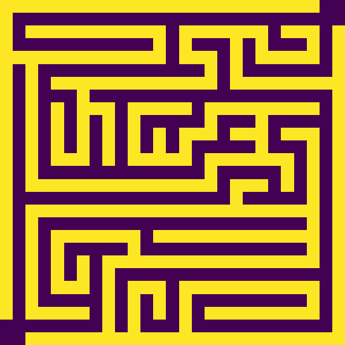
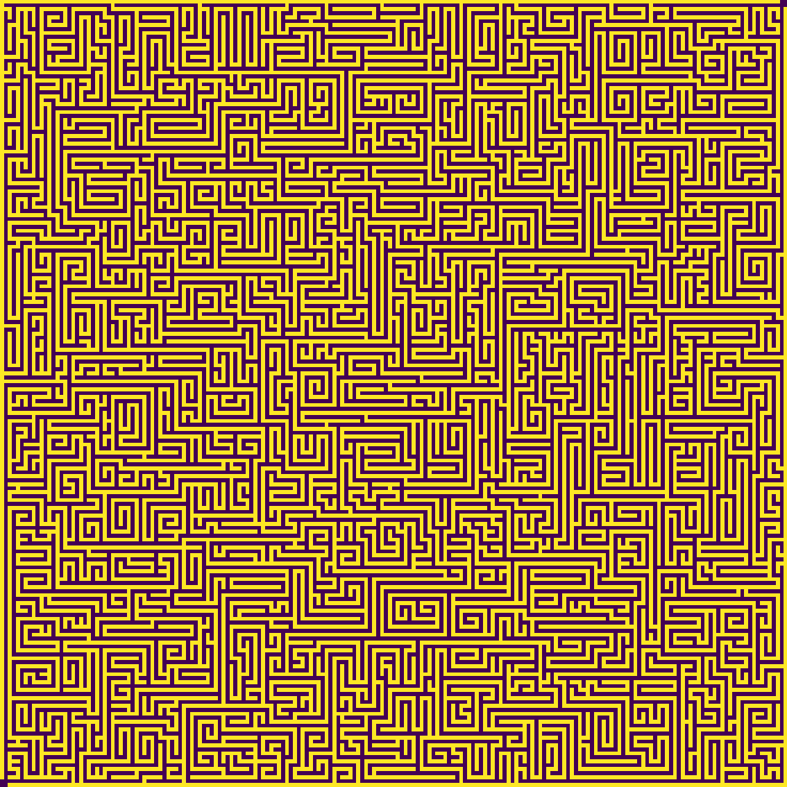
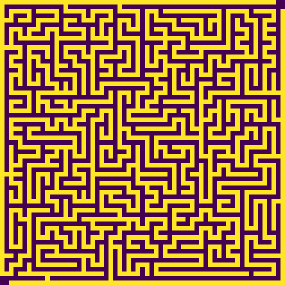
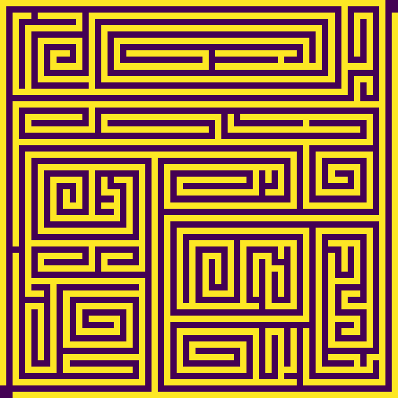
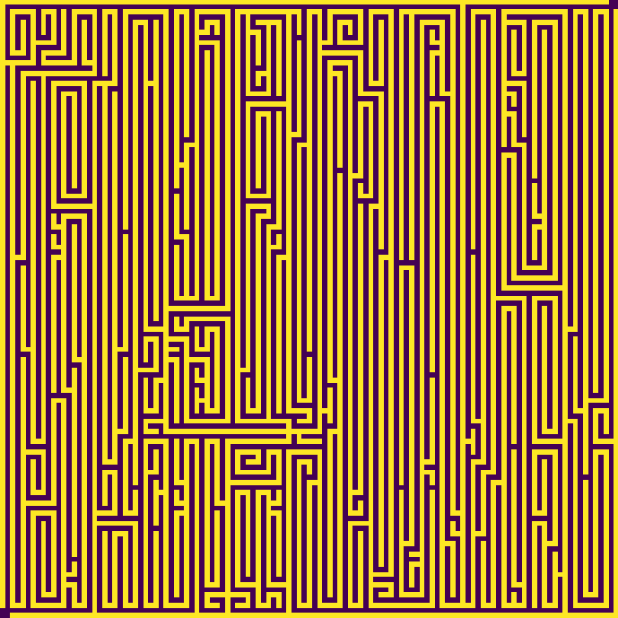
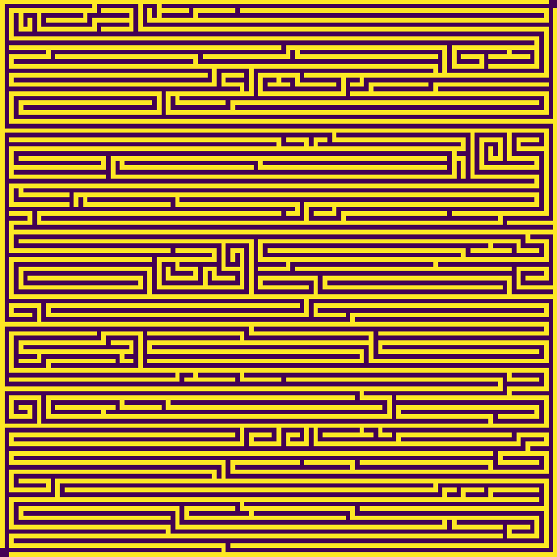

# labyrinth
## Create labyrinths with Python
 
### Examples

**Different Sizes**

</img>&nbsp;&nbsp;
</img>

**Low and Large Laziness Setting**

</img>&nbsp;&nbsp;
</img>

**Vertical or Horizontal Direction Bias**

</img>&nbsp;&nbsp;
</img>

**ASCII Mazes**

```
#I#I#I#I#I#I#I#I#I#I#I#I#I#I#I#I#I#I#I#I#I#I#I#I#I
#I  #I  #I          #I              #I
#I  #I  #I#I#I#I#I  #I  #I#I#I#I#I  #I#I#I#I#I#I#I  #I
#I  #I          #I  #I  #I  #I                      #I
#I  #I#I#I  #I#I#I  #I  #I  #I  #I#I#I#I#I#I#I  #I#I#I
#I  #I      #I          #I  #I  #I          #I  #I  #I
#I  #I  #I#I#I#I#I  #I#I#I  #I  #I  #I#I#I  #I#I#I  #I
#I  #I  #I          #I  #I  #I  #I  #I          #I  #I
#I  #I  #I  #I#I#I  #I  #I  #I  #I  #I  #I#I#I#I#I  #I
#I  #I  #I      #I  #I  #I      #I  #I  #I          #I
#I  #I  #I  #I#I#I  #I  #I  #I#I#I  #I  #I#I#I#I#I  #I
#I  #I  #I  #I      #I  #I  #I      #I          #I  #I
#I  #I  #I#I#I  #I#I#I  #I#I#I  #I  #I#I#I  #I#I#I  #I
#I          #I                  #I  #I      #I      #I
#I#I#I#I#I  #I  #I#I#I#I#I  #I  #I  #I  #I  #I  #I  #I
#I      #I      #I      #I  #I  #I  #I  #I  #I  #I  #I
#I  #I#I#I#I#I#I#I  #I#I#I#I#I  #I#I#I  #I#I#I#I#I  #I
#I                  #I  #I          #I              #I
#I  #I#I#I#I#I  #I#I#I  #I#I#I#I#I#I#I  #I#I#I#I#I  #I
#I  #I      #I  #I                      #I      #I  #I
#I  #I  #I#I#I  #I  #I#I#I#I#I#I#I#I#I#I#I#I#I  #I  #I
#I  #I  #I      #I  #I                      #I  #I  #I
#I  #I  #I  #I#I#I  #I#I#I#I#I  #I#I#I  #I  #I  #I  #I
#I  #I  #I              #I  #I      #I  #I          #I
#I  #I  #I#I#I#I#I#I#I#I#I  #I#I#I#I#I#I#I#I#I#I#I  #I
                                                #I  #I
    #I#I#I#I#I#I#I#I#I#I#I#I#I#I#I#I#I#I#I#I#I#I#I#I#I
```

### Usage

```
>> python ./labyrinth.py -h
Usage:
labyrinth.py [-s <side_length>] [-r <straight_ratio>] [-l <root_factor>] [-c <colormap name>] [-o <output file>] [-h]

Builds a random labyrinth using an automatic, random iterative wall growing algorithm.
There are two parent roots (outer walls). Sub-roots grow from these parent roots so long as there is enough room to grow in.
As both root families aren't allowed to touch, the maze is guaranteed to be a perfect maze (single and unique solution).

Depending on the -o parameter (see below) the labyrinth is shown in a window, saved as image or output to the terminal

-s:  size / side length in squares. Must be odd and below 256. Default: 63
-l:  laziness in range [0, 1] defines the laziness of direction change. A higher number leads to more straight lines. Default: 0.7
-b:  direction bias. Value between -1 and 1. -1 is a large bias in up-down direction, +1 in left-right direction. 0 means no bias. Default: 0
-r:  root_factor defines the maximum relative maximum length of a root the labyrinth walls get built of in each iteration. Normally this doesn't need to be adapted. Default: 1.3
-c:  colormap name for the pyplot. See the matplotlib documentation. Default: viridis
-o:  Specify a filepath string including filetype ending. With no output file a pyplot windows opens. Specify '-o stdout' for terminal output. By default a plot window is shown.
-h:  print this help

```

### Algorithm

Builds a random labyrinth using an automatic, random iterative wall growing algorithm.
There are two parent roots (outer walls). Sub-roots grow from these parent roots so long as there is enough room to grow in.
As all sub-roots are connected to the parent roots and both root families aren't allowed to touch, the maze is guaranteed to be a perfect maze (unique solution, no loops and no inaccessible areas).
Allowing only two-cell growth in each direction, sawtooth artifacts are removed and the maze complexity is increased.
Each root only grows up to a specific length. The rate of direction changes and directional bias are controlled by parameters.

See the commented program code for more details.

I came up with this algorithm, but maybe it already exists somewhere else.

### Requirements

The required libraries are numpy and matplotlib.
A python version above 3.10 is recommended.

### Similar tools

* [Lapyrinth](https://github.com/Pietot/Lapyrinth) by Baptiste Blasquez.
* [lapyrinth](https://github.com/will2dye4/labyrinth) by William Dye.

